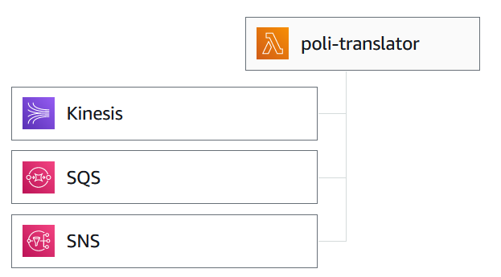

# poli-translator
A translator deployed on AWS Lambda.  

## Description

The translator is deployed as a function on AWS Lambda which has multiple triggers as depicted below.  

  

The translator receives events which contain a batch of items. Each item contains a message (text) and optionally the languages to translate from and to. The result for an event contains pairs, each pair consists of the original text and its translation.  

## Repository walkthough

The repository consists of the following resources:  

* source  
  The source code is a small Python package named **translation** which does the actual translation via [googletrans](https://pypi.org/project/googletrans/)
* tests  
  The source code is extensively unit tested with the **pytest** framework and can be found in the **tests** package
* packaging  
  The AWS Lambda function is packaged via a [Docker image](https://docs.aws.amazon.com/lambda/latest/dg/python-image.html) (see *Dockerfile*). *lambda_function.py* is the module containing the event handler called by Lambda
* commands  
  This directory contains Markdown files that describe the various Docker and AWS commands that can be run to package the source code and set up the various AWS resources

## Function input and output

The Lambda function can be invoked by us (manually) or by any of its triggers - an SQS queue, an SNS topic and a Kinesis stream. The relevant information passed to the function consists of a message and the two languages for translation. An example event for each trigger can be found in *tests/conftest.py*. An event sent via manual invokation is shown below.  

```bash
$ aws lambda invoke --function-name poli-translator --payload '{"text": "Hallo zusammen", "from_language": "de", "to_language": "en"}' --cli-binary-format raw-in-base64-out response.json
```

The function's response is a JSON document with multiple fields, the most important one is a list of pairs (one for each message in a batch). Each pair consists of the original message and its translation. For the example above there is only one message so the response looks like this:  

```json
{
  "py-version": [3, 8, 17, "final", 0],
  "func-name": "poli-translator",
  "func-version": "$LATEST",
  "translation": [
    ["Hallo zusammen", "Hello everyone"]
  ]
}
```

## References

[AWS Lambda](https://docs.aws.amazon.com/lambda/latest/dg/welcome.html)  

[Ingegration of AWS Lambda with other services](https://docs.aws.amazon.com/lambda/latest/dg/lambda-services.html)

